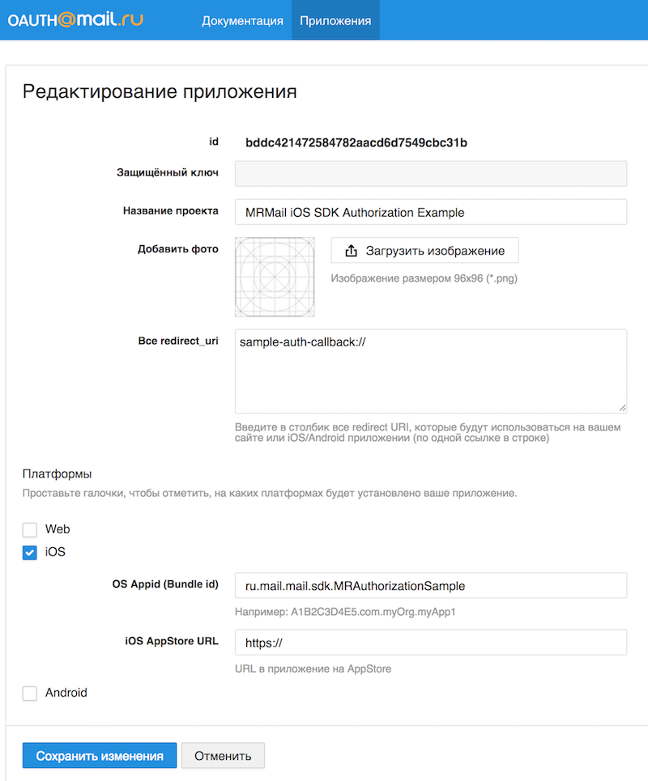

# Mail.Ru iOS SDK

SDK позволяет пользователям сторонних iOS приложений пройти авторизацию через учетную запись Mail.Ru. После этого можно использовать код авторизации для получения информации о пользователе, как описано в руководстве [OAuth 2.0 Авторизация](https://o2.mail.ru/docs/).

Страница проекта и исходный код: https://github.com/mailru/mail-auth-sdk-ios.

Поддерживаются версии iOS 9.0 и выше.

# Подготовка к использованию

Перед началом работы с Mail.Ru SDK необходимо [создать приложение](https://o2.mail.ru/app/). Сохраните ваш **ID приложения** и заполните обязательные поля.



## Настройка URL-схемы в iOS приложении

Для авторизации через Mail.Ru SDK необходимо настроить URL-схему вашего приложения. Для этого добавьте в раздел `URL Types → URL Schemes` файла `Info.plist` вашего проекта:

- Схему для возврата из приложения Почта Mail.Ru результатов авторизации. Ее нужно будет указать при инициализации SDK в свойстве `returnScheme`.
- Если вы выберете вариант авторизации через `SafariViewController`, необходимо так же добавить схему, указанную в настройках приложения в поле **redirect_uri**.

Эти схемы могут совпадать, тогда достаточно добавить в `Info.plist` только один пункт.

В раздел `LSApplicationQueriesSchemes` файла `Info.plist` добавьте схему `mr-mail-oauth2`. Благодаря этому, SDK сможет узнать, установлено ли приложение Почта Mail.Ru на устройстве и авторизоваться через него.

Подробнее об этих настройках вы можете прочитать в руководстве Apple [App Programming Guide for iOS](https://developer.apple.com/library/content/documentation/iPhone/Conceptual/iPhoneOSProgrammingGuide/Inter-AppCommunication/Inter-AppCommunication.html#//apple_ref/doc/uid/TP40007072-CH6-SW10) и [Information Property List Key Reference](https://developer.apple.com/library/content/documentation/General/Reference/InfoPlistKeyReference/Introduction/Introduction.html).

# Подключение SDK к приложению

Интегрировать библиотеку можно при помощи Cocoapods, Carthage или без использования менеджеров зависимостей. Примеры интеграции и использования можно найти в папке `samples`.

## С помощью CocoaPods

CocoaPods — это менеджер зависимостей в проектов на Objective-C и Swift, упрощающий процесс использования сторонних библиотек, таких как Mail.Ru SDK. Подробнее о нем вы можете прочитать в руководстве [Getting Started](https://guides.cocoapods.org/using/getting-started.html).

Добавьте в ваш Podfile строку:

```
pod 'MRMailSDK'
```

И выполните команду:

```
pod install
```

## С помощью Carthage

Добавьте в ваш `Cartfile` строку:

```
github "mailru/mail-auth-sdk-ios"
```

Выполните команду:

```
carthage update
```

И подключите собранный фреймворк к проекту как описано в [инструкции](https://github.com/Carthage/Carthage#if-youre-building-for-ios-tvos-or-watchos).

## Без использования менеджеров зависимостей

Добавьте проект `mr-mail-sdk.xcodeproj` в ваш проект в качестве подпроекта. Затем в свойствах вашего проекта найдите настройку `General → Embedded Binaries` и добавьте `mr-mail-sdk.framework`.

# Работа с SDK

## Инициализация

Поместите этот код в класс Application Delegate, заменив строки на те, что указаны в настройках вашего приложения:

```objective-c
#import <MRMailSDK/MRMailSDK.h>

@implementation AppDelegate

- (BOOL)application:(UIApplication *)application didFinishLaunchingWithOptions:(NSDictionary *)launchOptions {
    MRMailSDK *mailSDK = [MRMailSDK sharedInstance];
    [mailSDK initializeWithClientID:@"bddc421472584782aacd6d7549cbc31b"
                        redirectURI:@"sample-auth-callback://"];
    mailSDK.returnScheme = @"sample-auth-callback";
    return YES;
}

- (BOOL)application:(UIApplication *)app openURL:(NSURL *)url options:(NSDictionary<UIApplicationOpenURLOptionsKey, id> *)options {
    return [[MRMailSDK sharedInstance] handleURL:url
                               sourceApplication:options[UIApplicationOpenURLOptionsSourceApplicationKey]
                                      annotation:options[UIApplicationOpenURLOptionsAnnotationKey]];
}

@end
```

То же самое на Swift:

```swift
import MRMailSDK

@UIApplicationMain
class AppDelegate: UIResponder, UIApplicationDelegate, MRMailSDKDelegate {
    func application(_ application: UIApplication, didFinishLaunchingWithOptions launchOptions: [UIApplicationLaunchOptionsKey: Any]?) -> Bool {
        let mailSDK = MRMailSDK.sharedInstance()
        mailSDK.initialize(withClientID: "bddc421472584782aacd6d7549cbc31b", redirectURI: "sample-auth-callback://")
        mailSDK.returnScheme = "sample-auth-callback"
        return true
    }

    func application(_ app: UIApplication, open url: URL, options: [UIApplicationOpenURLOptionsKey : Any] = [:]) -> Bool {
        let sourceApplication = options[.sourceApplication] as? String
        let annotation = options[.annotation] as? String
        return MRMailSDK.sharedInstance().handle(url, sourceApplication: sourceApplication, annotation: annotation)
    }
}
```

## Авторизация через учетную запись Mail.Ru

Задайте делегат, ему будут передаваться результаты авторизации.

```objective-c
MRMailSDK.sharedInstance.delegate = self;
```

Вызовите метод `authorize`, чтобы авторизоваться:

```
[MRMailSDK.sharedInstance authorize];
```

Или воспользуйтесь готовой кнопкой `MRMailSignInButton`.


Если у пользователя установлено приложение Почта Mail.Ru и при инициализации был задан параметр `returnScheme`, то авторизация пройдет через него без ввода логина и пароля. Иначе откроется веб-интерфейс. Через параметр `internalAuthMode` можно задать, чтобы веб-интерфейс открывался в `SFSafariViewController` или в Web View, встроенном в SDK.

В результате авторизации вызовется один из методов делегата. В случае успешной авторизации SDK вызовет метод `-[MRMailSDKDelegate mrMailSDK:authorizationDidFinishWithCode:]`, передав в него код авторизации. Этот код затем можно обменять на токен, а токен можно использовать для получения информации о пользователе, как описано в руководстве [OAuth 2.0 Авторизация](https://o2.mail.ru/docs/).

## Ошибки авторизации

В случае ошибки будет вызван метод `-[MRMailSDKDelegate mrMailSDK:authorizationDidFailWithError:]`. Возможны следующие коды ошибок:

- `kMRSDKUninitializedErrorCode` (0) — SDK не был инициализирован.
- `kMRSDKIncorrectClientIdErrorCode` (1) — неправильный id приложения.
- `kMRSDKAuthorizationAlreadyInProgressErrorCode` (2) — процесс авторизации уже запущен и еще не завершился.
- `kMRSDKOAuthErrorCode` (3) — ошибка OAuth API.
- `kMRSDKNetworkErrorCode` (4) — сетевая ошибка.
- `kMRSDKCanceledByUserErrorCode` (5) — процесс авторизации прерван пользователем.
- `kMRSDKUnauthorizedApplicationErrorCode` (6) — ваше приложение не имеет разрешения на авторизацию.
- `kMRSDKExternalOAuthDisabledErrorCode` (7) — OAuth авторизация отключена.
- `kMRSDKExternalOAuthRefuseErrorCode` (8) — OAuth авторизация отклонена.

